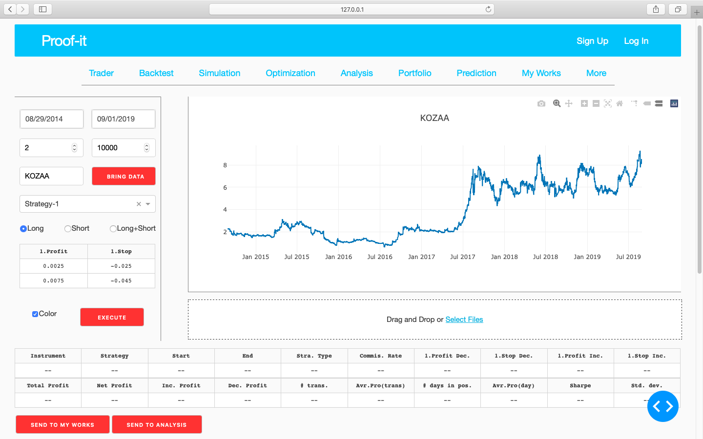
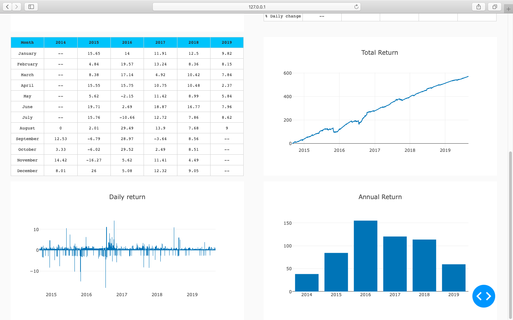

# This file contains trading strategies together with a documentation of my personal project named Proof-it. Coded with Python/Dash(Plotly), Proof-it is a ML and a backtest algorithm that can be applied on financial instruments.

### Backtest page

### Simulation page

### Optimization page

### Analysis page

